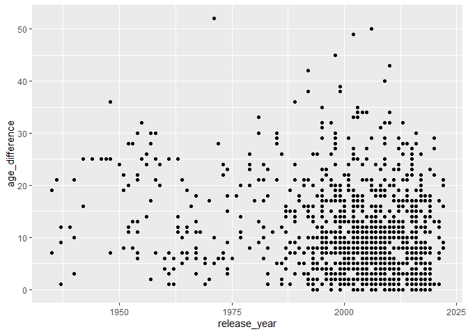
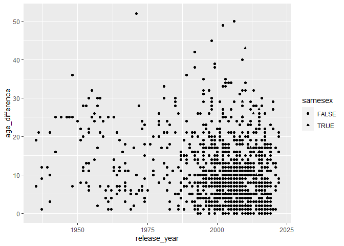
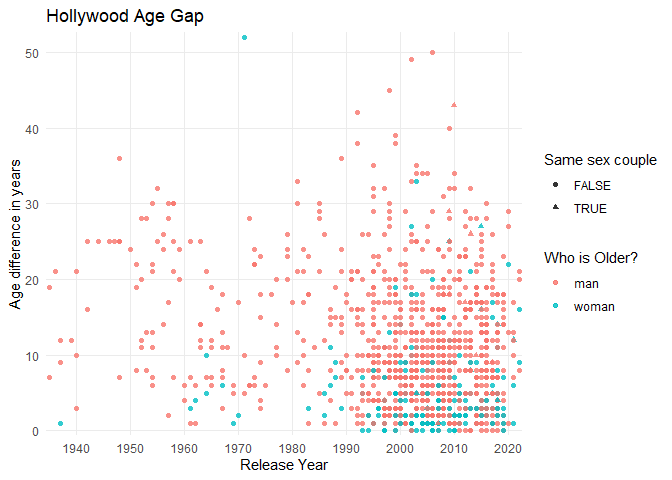
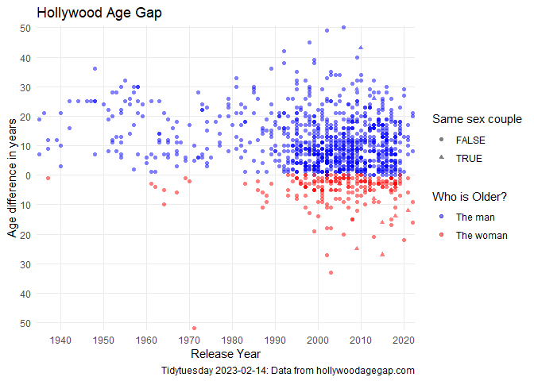
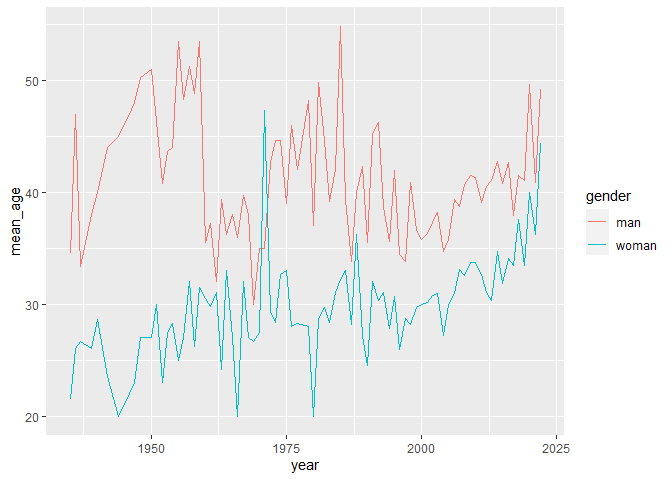
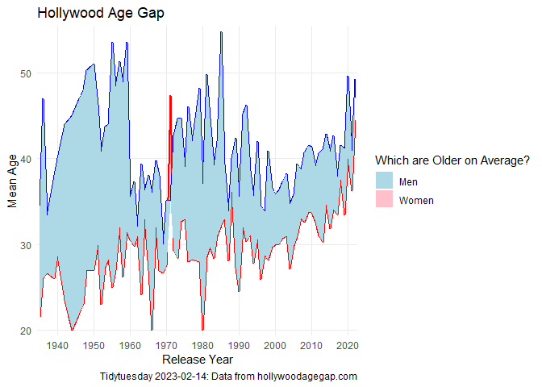
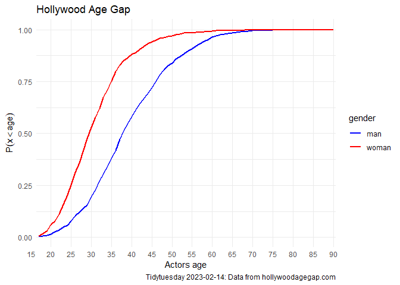

TidyTuesday: Age gaps in Hollywood movies.
================
Hrólfur Ásmundsson
2023-02-14

``` r
library(tidyverse)
library(tidytuesdayR)
```

This weeks data set comes from
[hollywoodagegap.com](hollywoodagegap.com). As usual it is easy very to
load the data using the **`tidytuesdayR`** package

``` r
tuesdata <- tidytuesdayR::tt_load(2023, week = 7)
# save and set eval=FALSE so I don't need to call github any time I Knit :)
write_csv(tuesdata$age_gap,"age_gap.csv")  
```

Let’s begin by exploring the data set

``` r
data <- read_csv("age_gap.csv")
head(data)
```

    ## # A tibble: 6 × 13
    ##   movie_name     relea…¹ direc…² age_d…³ coupl…⁴ actor…⁵ actor…⁶ chara…⁷ chara…⁸
    ##   <chr>            <dbl> <chr>     <dbl>   <dbl> <chr>   <chr>   <chr>   <chr>  
    ## 1 Harold and Ma…    1971 Hal As…      52       1 Ruth G… Bud Co… woman   man    
    ## 2 Venus             2006 Roger …      50       1 Peter … Jodie … man     woman  
    ## 3 The Quiet Ame…    2002 Philli…      49       1 Michae… Do Thi… man     woman  
    ## 4 The Big Lebow…    1998 Joel C…      45       1 David … Tara R… man     woman  
    ## 5 Beginners         2010 Mike M…      43       1 Christ… Goran … man     man    
    ## 6 Poison Ivy        1992 Katt S…      42       1 Tom Sk… Drew B… man     woman  
    ## # … with 4 more variables: actor_1_birthdate <date>, actor_2_birthdate <date>,
    ## #   actor_1_age <dbl>, actor_2_age <dbl>, and abbreviated variable names
    ## #   ¹​release_year, ²​director, ³​age_difference, ⁴​couple_number, ⁵​actor_1_name,
    ## #   ⁶​actor_2_name, ⁷​character_1_gender, ⁸​character_2_gender

We have a lot of different data that we could look at and many
interesting things to learn from it. I think I find it most interesting
to see if the age difference between women and men is getting smaller in
modern times.

## Simple scatter plot

To see this lets first simply make a scatter plot of age difference as a
function of the release year.

``` r
g1<- data %>%
  ggplot(aes(x=release_year,y=age_difference))+
  geom_point()
g1
```

<!-- -->

From this we see that points get more dense at lower age difference
after the turn of the century, but it could also be because there are a
lot more movies made. Thankfully not all the couples in movies are
heterosexual. In fact there are in total 23 different same sex couples.
Let’s also identify them on the figure.

``` r
n_same_sex <- sum(data$character_1_gender==data$character_2_gender)
n_same_sex
```

    ## [1] 23

``` r
g2<- data %>%
  mutate(samesex=data$character_1_gender==data$character_2_gender) %>%
  ggplot(aes(x=release_year,y=age_difference,shape=samesex))+
  geom_point()
g2
```

<!-- -->

Our figure does not yet distinguish between when the woman or the man is
older so lets introduce a color scheme for that. We can make use of the
fact that the data set has been made so that `charecter_1` is always
older than `character_2.`

``` r
g3<- data %>%
  mutate(samesex=character_1_gender==character_2_gender) %>%
  ggplot(aes(x=release_year,y=age_difference,shape=samesex,color=character_1_gender))+
  geom_point(alpha=0.8)+
  theme_minimal()+
  scale_x_discrete(name ="Release Year", 
                   limits=seq(1940,2023,10))+
  scale_y_discrete(name ="Age difference in years", 
                   limits=seq(0,50,10))+
  scale_fill_manual(values=c("man"="blue","woman"="red"),labels=c("The man","The woman"))+
  labs(title="Hollywood Age Gap",color="Who is Older?",shape="Same sex couple")

g3
```

<!-- -->

The points are rather clustered in the lower right corner so it is not
very easy to make out. So lets plot the age difference relative to the
age of the woman.

``` r
g4 <- data %>%
  mutate(samesex=data$character_1_gender==data$character_2_gender) %>%
  mutate(relative_gap = if_else(character_1_gender=="man",age_difference,-age_difference)) %>% 
  ggplot(aes(x=release_year,y=relative_gap,color=character_1_gender,shape=samesex))+
  geom_point(alpha=0.5)+
  theme_minimal()+
  scale_x_discrete(name ="Release Year", 
                   limits=seq(1940,2023,10))+
  scale_y_discrete(name ="Age difference in years", 
                   limits=seq(-50,50,10),labels=abs(seq(-50,50,10)))+
  scale_color_manual(values=c("man"="blue","woman"="red"),labels=c("The man","The woman"))+
  labs(title="Hollywood Age Gap",color="Who is Older?",shape="Same sex couple",caption="Tidytuesday 2023-02-14: Data from hollywoodagegap.com")

g4
```

<!-- -->

This is our final version of this figure, it is pretty clear, from the
figure, that it is still much likelier that the man is older.

## Colored Ribbon graph

To investigate this further, let’s consider the mean age of women and
man actors every year of the data set.

``` r
g5<- tibble(movie = c(data$movie_name,data$movie_name),
            year = c(data$release_year,data$release_year),
            age = c(data$actor_1_age,data$actor_2_age),
            gender = c(data$character_1_gender,data$character_2_gender)) %>% 
  group_by(year,gender) %>% 
  summarise(mean_age = mean(age)) %>% 
  ggplot(aes(x=year,y=mean_age,color=gender)) +
  geom_line()
g5
```

<!-- -->

The mean age of man actors is consistently above the women, except for
the year 1971, but that is due to a single movie *Harold and Maude*
where the woman is 52 years older than the man.

``` r
data %>% filter(release_year==1971) %>% select(movie_name,age_difference,actor_1_name,actor_2_name)
```

    ## # A tibble: 3 × 4
    ##   movie_name           age_difference actor_1_name  actor_2_name 
    ##   <chr>                         <dbl> <chr>         <chr>        
    ## 1 Harold and Maude                 52 Ruth Gordon   Bud Cort     
    ## 2 Diamonds Are Forever             10 Sean Connery  Jill St. John
    ## 3 Le Mans                           5 Steve McQueen Elga Andersen

Lets visualize the difference with a colored ribbon,

``` r
g6<- tibble(movie = c(data$movie_name,data$movie_name),
            year = c(data$release_year,data$release_year),
            age = c(data$actor_1_age,data$actor_2_age),
            gender = c(data$character_1_gender,data$character_2_gender)) %>% 
  group_by(year,gender) %>% 
  summarise(mean_age = mean(age)) %>% 
  pivot_wider(names_from = gender, values_from = mean_age) %>% 
  mutate(higer = ifelse(man>woman,"man","woman")) %>% 
  ggplot(alpha=0.5) +
  geom_ribbon(aes(x=year,ymin=woman,ymax=pmin(man,woman),fill="Woman"))+
  geom_line(aes(x=year,y=man),color="blue",size=1)+
  geom_line(aes(x=year,y=woman),color="red",size=1)+
  geom_ribbon(aes(x=year,ymin=man,ymax=pmin(man,woman),fill="Man"))+
  theme_minimal()+
  scale_x_discrete(name ="Release Year", 
                   limits=seq(1940,2023,10))+
  scale_y_discrete(name ="Mean Age", 
                   limits=seq(-50,50,10),labels=abs(seq(-50,50,10)))+
  scale_fill_manual(values=c("Man"="lightblue","Woman"="pink"),labels=c("Men","Women"))+
  labs(title="Hollywood Age Gap",fill="Which are Older on Average?",shape="Same sex couple",caption="Tidytuesday 2023-02-14: Data from hollywoodagegap.com")
g6
```

<!-- -->

## Age distributions

As our final figure we shall find the empirical distribution function
for the age of the actors of each gender.

``` r
Emperical_DF <- tibble(movie = c(data$movie_name,data$movie_name),
            year = c(data$release_year,data$release_year),
            age = c(data$actor_1_age,data$actor_2_age),
            gender = c(data$character_1_gender,data$character_2_gender)) %>% 
  group_by(gender) %>% summarise(edf = list(ecdf(age)))

g7 <- tibble(age = rep(17:90,2),
                     p = c(Emperical_DF$edf[1][[1]](17:90),Emperical_DF$edf[2][[1]](17:90)),
                     gender = rep(c("man","woman"),each=74)) %>% 
  ggplot(aes(x=age,y=p,color=gender))+
  geom_line(size=1)+
  scale_color_manual(values=c("man"="blue","woman"="red"))+
  theme_minimal()+
  scale_x_discrete(name ="Actors age", 
                   limits=seq(15,90,5))+
  labs(title="Hollywood Age Gap",fill="Which are Older on Average?",shape="Same sex couple",caption="Tidytuesday 2023-02-14: Data from hollywoodagegap.com")+
  ylab(expression(P(x < age)))
g7
```

<!-- --> We
clearly see that the men are older and last longer as possible “love
interests”, we see that for example there is roughly 50% chance that an
actress is younger than 30 years old, while there is only 20% chance for
men.

``` r
Emperical_DF$edf[1][[1]](30)
```

    ## [1] 0.1963668

``` r
Emperical_DF$edf[2][[1]](30)
```

    ## [1] 0.5311958
