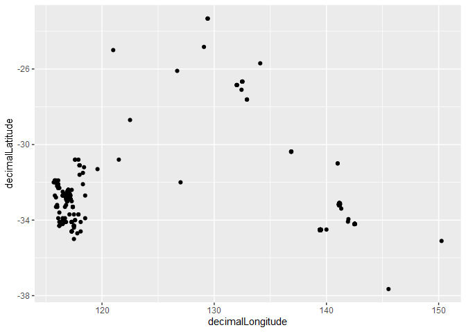
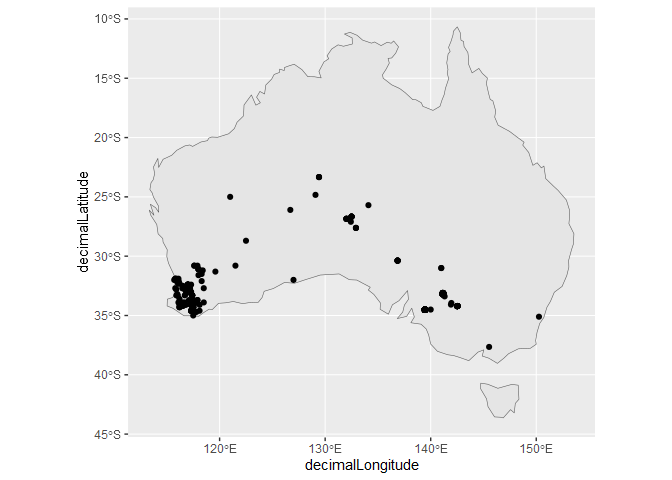

TidyNumbats
================
Hrólfur Ásmundsson
2023-03-07

## The data

The data [this
week](https://github.com/rfordatascience/tidytuesday/blob/master/data/2023/2023-03-07/readme.md)
comes from the the [Atlas of Living Australia](https://www.ala.org.au/),
Di Cook prepared the data. The data consists of individual sightings of
numbats, that are an endangered species of marsupials living exclusively
in Australia

As usual it is very easy to import the data

``` r
library(tidyverse)
library(tidytuesdayR)

tuesdata <- tidytuesdayR::tt_load(2023, week = 10)
```

    ## 
    ##  Downloading file 1 of 1: `numbats.csv`

``` r
numbats <- tuesdata$numbats
```

## Distribution

This data set gives a great opportunity to create a map, as the latitude
and longitude of the sightings is given in the data set.

``` r
g1 <- numbats %>% 
  ggplot(aes(x=decimalLongitude,y=decimalLatitude))+
  geom_point()
g1
```

<!-- -->

To put the points into perspective we should plot them on top of a map
of Australia. We get the shape file from the `raturalearth` package.

``` r
library(rnaturalearth)
australia_map <- ne_countries(country = "australia", returnclass = "sf")

g2 <-  ggplot() +
  geom_sf(data = australia_map) +
geom_point(data=numbats,aes(y= decimalLatitude,x=decimalLongitude))
g2
```

<!-- -->

This is looking nice and we see the numbats are most likely found in a
small area in Western Australia.

Let’s now finish by making the map look better. We change the axis
labels, include a title, and represent the country and numbats in the
national green and gold colors.

``` r
g3 <-  ggplot() +
  geom_sf(data = australia_map,fill="#00843D") +
geom_point(data=numbats,aes(y= decimalLatitude,x=decimalLongitude),color="#FFCD00")+
  xlab("Longitude")+
  ylab("Latitude")+
  theme(axis.line = element_blank(),
    panel.grid = element_blank(),    
    panel.background = element_rect(fill = '#006994'))+
  ggtitle("Numbat sightings in Australia")
g3
```

<!-- -->
